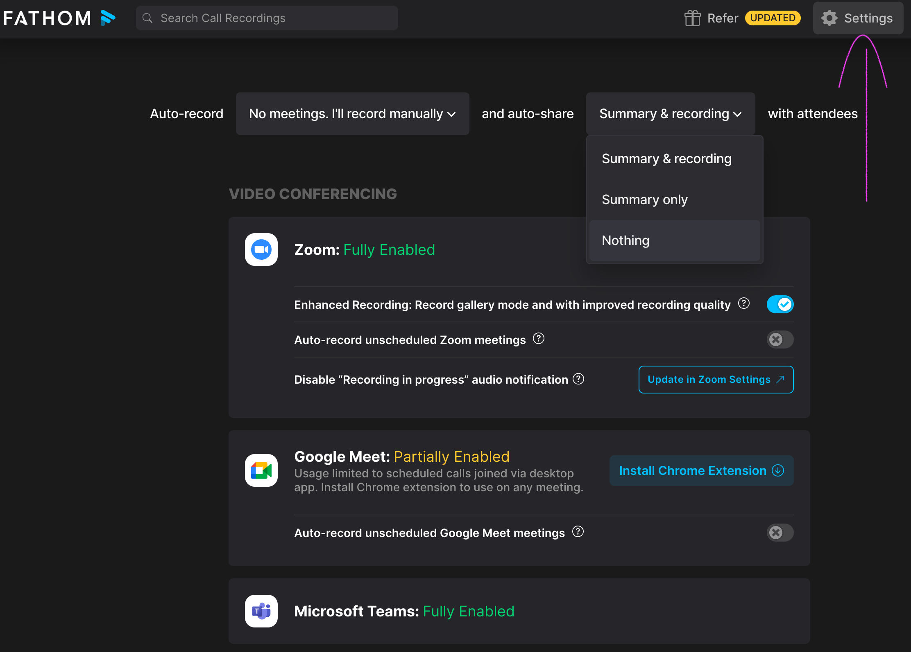
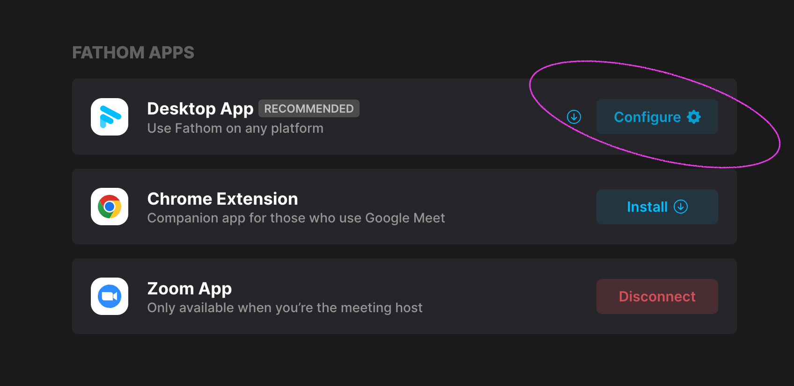

# AI notetaker: Fathom set-up

> Participants should always be informed of being recorded. Please remember to ask them before the meeting or at the beginning of the meeting.
> - You can attach in the calendar invite: "This meeting will be recorded using GDPR-compliant AI tools for note-taking purposes. We can share the recording and summaries with you for your review. If you do not wish to be recorded, please let us know."
> - Or you can ask this when the meeting starts: "Is it okay if I record this meeting using GDPR-compliant AI tools for note-taking purposes?"

## What you need to do

1. Create a free account and [login](https://fathom.video/)
1. On the web browser, go to "Settings" (located at top right)

    - To have full control when using this tool, in the top sentence we advise that you select "No meetings. I'll record manually" and "Nothing". This means that you can (manually) share the recordings and/or summary AFTER you review the AI-generated notes.
    - Under video conferencing, please enable "Zoom".

1. Under "Fathom apps", click "Configure"

    - Adjust the Desktop setting to:
        - Upcoming meeting notifications: on
        - Auto-open on join meeting: off
        - Invisible when screen sharing: on
        - Real-time coaching: on

## More information

- [Fathom quick start guides](https://help.fathom.video/en/categories/74880)
- Using Fathom [after a call](https://help.fathom.video/en/categories/65984-using-fathom-after-a-call)
