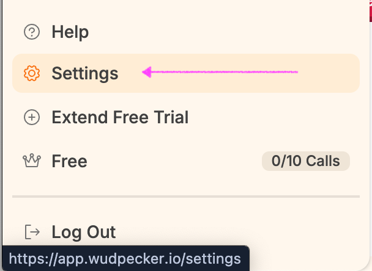
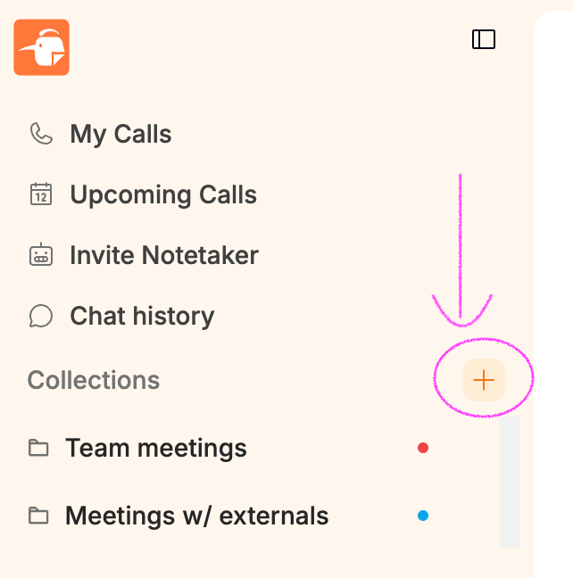
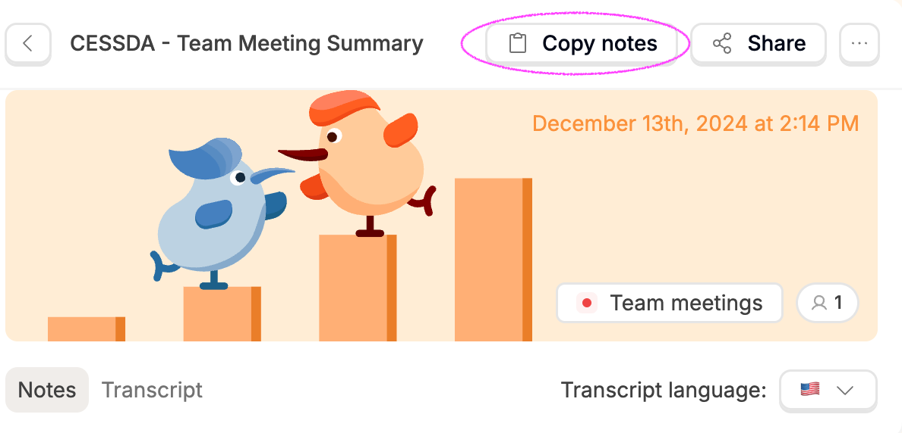
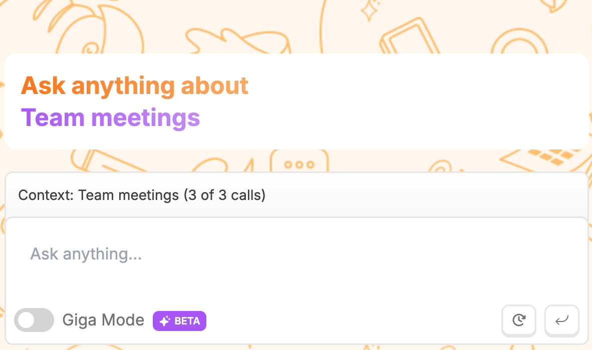

# AI notetaker: Wudpecker set-up

> Participants should always be informed of being recorded. Please remember to ask them before the meeting or at the beginning of the meeting.
> - You can attach in the calendar invite: "This meeting will be recorded using GDPR-compliant AI tools for note-taking purposes. We can share the recording and summaries with you for your review. If you do not wish to be recorded, please let us know."
> - Or you can ask this when the meeting starts: "Is it okay if I record this meeting using GDPR-compliant AI tools for note-taking purposes?"

## What you need to do

1. Create a free account and [log in](https://www.wudpecker.io/ai-notetaker)
1. Download [MacOS app](https://www.wudpecker.io/macos-app) (to record bot-free, e.g., during in-person meetings)
1. Set-up by going to "Settings" (located at bottom-left): 

    - Under "Recording bot" > "bot default joining rules", please set it to "None: You choose manually which calls to join". 
    - Under "Integrations", please disable "Zoom", so that you have the option to use this AI notetaker when you want.

## More information

- [How Wudpecker works](https://www.wudpecker.io/blog/how-wudpecker-works-step-by-step-guide)
- [Blogs](https://www.wudpecker.io/blog)

## Create collection (Below is a template for you to copy/paste)

- I suggest creating instructions for 2 types of notes for an internal (MO only) and external audience.
- To create collections (similar to folders), please click the "+" sign next to "Collections".

### Collection name 1: Team meetings

Instructions to customize summaries

> Structure: I want to see key discussions and action points for the calls in this collection.
>
> Keywords: The company name is "CESSDA", the team includes Bonnie, Alen, Vanja, Nina, Matthew, Einar, and Lorraine.
>
> Desired format: short paragraphs or bullet points. Do not want to see small talk.

Auto-add calls to collection

> This collection includes calls that have "team" in the title.

### Collection name 2: Meetings w/ externals

Instructions to customize summaries

> Structure: I want it to start with the objective of the meeting, a summary of the meeting, main questions/concerns, and then action points.
>
> Keywords: The company name is "CESSDA", the team includes Bonnie, Alen, Vanja, Nina, Matthew, Einar, and Lorraine.
>
> External colleagues who often join our meetings include: Ami, Irena, Marijana, Bojana, Helena, Mari, Nicolas, and Kostas.
>
> Terms: "PID" means persistent identifier. "ERIC" means European Research Infrastructure Consortium. "Matomo" is our content management system. "EC" means the European Commission.
>
> Desired format: short paragraphs or bullet points. Use tables for comparisons of pros and cons, or strengths and weaknesses. Do not want to see small talk.

Auto-add calls to collection

> This collection includes calls that have "webinar", "Q&A", "FAQ", "SPF", "GA", "Working Group", "WG", "Task Force", or "TF" in the title.

## Feature highlight

- I can "Copy notes" and paste them to a Google Doc to edit
- Under "...", I can "rename" the title
- On the right side "Ask anything about" is a cool feature where you can ask questions to AI related to your meeting recordings/notes

